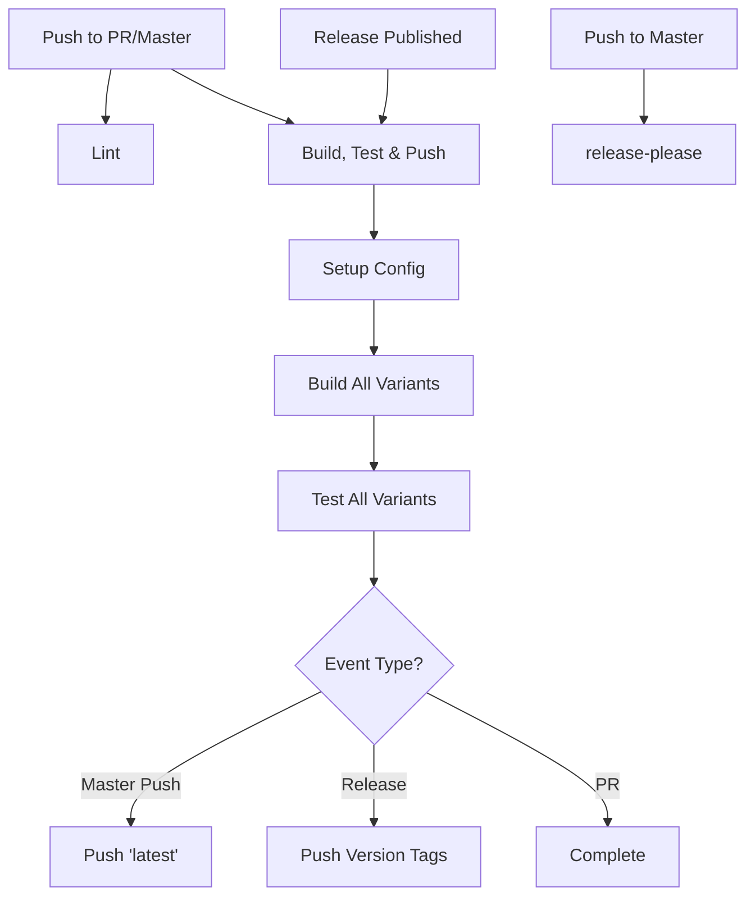

# GitHub Actions Workflows Documentation

This document explains the CI/CD workflow structure for this project.

## Overview

The project uses GitHub Actions for automated building, testing, and deployment of Docker images. The workflow structure uses centralized configuration to minimize code duplication.

## Workflow Architecture



## Workflows

### 1. Lint (`lint.yml`)

**Triggers:** PR and master push (when Dockerfile, scripts, or workflows change)

**Purpose:** Validates code quality

**Jobs:**
- `hadolint` - Lints Dockerfile for best practices
- `shellcheck` - Validates shell scripts

### 2. Build, Test & Push (`build-test-push.yml`)

**Triggers:**
- Pull requests
- Push to master
- Release published

**Purpose:** Complete CI/CD pipeline for Docker images

**Jobs:**

1. **setup** - Loads centralized configuration
   - Uses sparse checkout (.github/config + .github/actions only)
   - Reads `.github/config/variants.json`
   - Outputs: image name, variants matrix, default variant, retention days

2. **build** - Builds all 12 Docker image variants in parallel
   - Uses matrix strategy from centralized config
   - Runs Trivy security scanning on all variants
   - Compresses images with gzip (~50% size reduction)
   - Uploads compressed artifacts for downstream jobs
   - Uses GitHub Actions cache for Docker layer caching

3. **test-structure** - Validates container structure (all variants)
   - Uses sparse checkout (tests + .github/actions only)
   - Downloads and decompresses image artifacts
   - Runs container-structure-test on all 12 variants
   - Ensures all variants meet quality standards

4. **test-health** - Health check validation (all variants, optional)
   - Uses sparse checkout (tests + .github/actions only)
   - Downloads and decompresses image artifacts
   - May fail without game files (expected in CI)
   - Marked as `continue-on-error: true`

5. **push-latest** - Pushes 'latest' tag (master only)
   - Only runs on successful push to master
   - Downloads and loads default variant image
   - Tags default variant as `latest`
   - Pushes to Docker Hub
   - Creates job summary with deployment details

6. **push-release** - Pushes semantic version tags (releases only)
   - Only runs on release events
   - Downloads and loads all variant images
   - Uses docker/metadata-action for tag generation
   - Generates multiple tags per variant:
     - Immutable: `5.0.1-1_3_nodelay_va_loc`
     - Mutable: `5.0.1`, `5.0`, `5`
     - Variant: `1_3_nodelay_va_loc`
     - Latest: `latest` (default variant only)
   - Creates job summary for default variant

### 3. Release Please (`release-please.yml`)

**Triggers:** Push to master

**Purpose:** Automates semantic versioning and changelog generation

**How it works:**
- Analyzes conventional commits
- Creates/updates release PR with version bump and changelog
- When merged, creates GitHub release and triggers build-test-push workflow

## Centralized Configuration

### Variants Configuration (`.github/config/variants.json`)

Single source of truth for:
- Docker image name
- Default variant
- All server variants (12 total)
- Artifact retention settings

**Example:**
```json
{
  "image_name": "bgauduch/cod2server",
  "default_variant": {
    "cod2_version": "1_3",
    "cod2_lnxded_type": "_nodelay_va_loc"
  },
  "variants": [
    {"cod2_version": "1_0", "cod2_lnxded_type": "a"},
    ...
  ]
}
```

### Release Please Configuration (`.github/config/`)

- `release-please-config.json` - Release Please settings
- `release-please-manifest.json` - Current version tracking

## Composite Actions

Reusable actions to reduce duplication:

### `setup-config`

**Location:** `.github/actions/setup-config/action.yml`

**Purpose:** Loads and parses variants.json

**Outputs:**
- `image_name` - Docker image name
- `default_variant` - Default variant tag
- `variants_matrix` - JSON matrix for all variants
- `artifact_retention_days` - Artifact retention period

### `load-docker-image`

**Location:** `.github/actions/load-docker-image/action.yml`

**Purpose:** Downloads, loads, and verifies Docker image artifacts

**Inputs:**
- `image_tag` (required) - Tag of image to load (e.g., `1_3_nodelay_va_loc`)
- `image_name` (required) - Docker image name (e.g., `bgauduch/cod2server`)
- `github_token` (optional) - For artifact download (defaults to current token)
- `run_id` (optional) - Workflow run to download from (defaults to current run)

**Features:**
- Supports both compressed (`.tar.gz`) and uncompressed (`.tar`) artifacts
- Automatic decompression for gzip-compressed images
- Verification step ensures image loaded successfully
- Clear error messages with file listing on failure

## Docker Image Tags

### Tagging Strategy

**Immutable (recommended for production):**
- `5.0.1-1_3_nodelay_va_loc` - Full version + variant

**Mutable (updated with releases):**
- `latest` - Latest master build (default variant)
- `5.0.1` - Specific patch version (all variants)
- `5.0` - Latest minor version (all variants)
- `5` - Latest major version (all variants)
- `1_3_nodelay_va_loc` - Latest build of specific variant

## Modifying Workflows

### Adding a New Server Variant

1. Edit `.github/config/variants.json`
2. Add variant to `variants` array:
   ```json
   {
     "cod2_version": "1_3",
     "cod2_lnxded_type": "_new_variant"
   }
   ```
3. Commit and push - workflows automatically pick up changes

### Changing Default Variant

1. Edit `.github/config/variants.json`
2. Update `default_variant` object
3. Commit - affects `latest` tag behavior

### Changing Image Name

1. Edit `.github/config/variants.json`
2. Update `image_name` field
3. All workflows automatically use new name

## Troubleshooting

### Build Fails for One Variant

- Check build logs for the specific variant
- Matrix strategy continues building other variants
- Each variant builds independently

### Tests Fail

**Structure Tests:**
- Check container-structure-test.yaml
- Verify image was built correctly
- All variants must pass

**Health Tests:**
- These are optional (`continue-on-error: true`)
- Expected to fail without game files
- Not a blocker for PR approval

### Push Doesn't Trigger

**For 'latest' tag:**
- Only runs on push to master (not PRs)
- Requires successful build and tests
- Check workflow conditions

**For version tags:**
- Only runs on release events
- Ensure release was properly published
- Check Docker Hub credentials in secrets

### Configuration Not Loading

- Verify `.github/config/variants.json` syntax
- Run `jq` validation locally:
  ```bash
  jq . .github/config/variants.json
  ```
- Check setup-config action logs

## Performance Optimizations

### Artifact Compression

Docker image artifacts are compressed with gzip to reduce storage and transfer costs:

- **Before**: ~500MB per variant (uncompressed tar)
- **After**: ~250MB per variant (gzip compressed)
- **Total savings**: ~3GB for all 12 variants

The `load-docker-image` composite action automatically handles both compressed and uncompressed artifacts for backward compatibility.

### Sparse Checkout

Workflows use sparse checkout to only fetch required files:

- **setup job**: Only `.github/config` and `.github/actions`
- **test jobs**: Only `tests` and `.github/actions`
- **push jobs**: No checkout needed (artifacts only)

**Benefits:**
- ~90% faster checkout times
- Reduced network usage
- Faster job initialization

### Docker Layer Caching

Build job uses GitHub Actions cache for Docker layers:

```yaml
cache-from: type=gha
cache-to: type=gha,mode=max
```

**Benefits:**
- Faster builds on subsequent runs
- Reduced build times for unchanged layers
- Automatic cache management by GitHub

### Job Summaries

Jobs provide markdown summaries for better visibility:

- `push-latest`: Shows image name, variant, and event type
- `push-release`: Shows version, variant, and all tags published

Accessible via the Actions UI summary tab.

## Security

### Secrets Required

- `DOCKERHUB_USERNAME` - Docker Hub username
- `DOCKERHUB_PASSWORD` - Docker Hub access token

### Security Scanning

- Trivy scans all images during build
- Results uploaded to GitHub Security tab
- SARIF format for integration with GitHub

### Permissions

Workflows use minimal required permissions:
- `contents: read` - Read repository
- `security-events: write` - Upload security scan results

## Resources

- [GitHub Actions Documentation](https://docs.github.com/en/actions)
- [Docker Official Actions](https://github.com/docker/build-push-action)
- [Release Please](https://github.com/googleapis/release-please)
- [Conventional Commits](https://www.conventionalcommits.org/)
